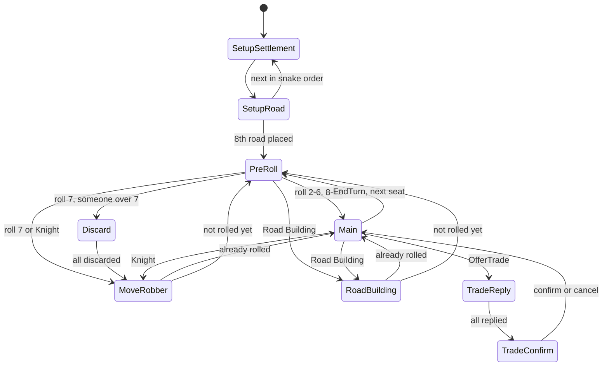

# M0 + M1 Design Brief: Setup and Rules Engine

Condensed from the design brief of Sep 21, 2026. The PDF is the source of truth; this copy exists so the plan lives with the code.

## Goals and done-when

| Milestone | Delivers | Done when |
|---|---|---|
| M0 Setup (~1 week) | Tools installed, repo on GitHub, Core / AI / Sim / Tests solution, Godot project referencing Catan.Core, CI on every push | Godot scene shows a number computed in Catan.Core, and GitHub Actions passes. **Done 2026-09-22.** |
| M1 Rules engine (~3–4 weeks) | Board topology and generators, GameState, every base-game action and rule, events, seeded chance, PlayerView, save and replay, RandomBot, Sim CLI | 100,000 random games finish with zero rule-consistency violations, every saved game replays to the identical state hash, all rules tests pass |

Scope: base game, 4 players, 10 VP, one human seat. Out of scope for M1: bots smarter than random, the Godot board UI, the hand tracker, trade counter-offers (M5). Later: M2 draws the board in Godot, M3 hand tracker and bots, M9 review timeline.

Layout: `src/Catan.Core` (rules engine, no Godot references), `src/Catan.AI` (bots), `src/Catan.Sim` (console tool), `tests/Catan.Tests` (xUnit), `game/` (Godot project, not in `CatanAI.sln`, so CI never needs Godot). All libraries target net8.0.

## Build order and review checkpoints

Write each step's tests with the step. **Stop at checkpoints A–D for review** before continuing. Until step 9 exists, a rolled 7 just skips production.

| # | Build | Tests with it | Checkpoint |
|---|---|---|---|
| 1 | Enums (Resource, DevCardType, Phase, ActionType), ResourceSet, cost table | ResourceSet math, FitsIn | |
| 2 | Topology: keys, ids, adjacency tables, harbor spots | All the topology counts | **A**: ids and tables |
| 3 | PCG32 Rng, RngChance, ScriptedChance | Same seed → same sequence; NextInt roughly uniform | |
| 4 | BoardGenerator: Random, Balanced, JSON | Board generation row | |
| 5 | GameState, CopyFrom, ComputeHash, StateValidator, StateBuilder | Clone and hash tests | |
| 6 | Setup phase | Setup row | |
| 7 | RollDice, production, bank shortage | Production row | |
| 8 | Main phase: roads, settlements, cities, BuyDevCard, EndTurn | Building row | **B**: first full turn loop |
| 9 | Discard, MoveRobber, steal, friendly robber | Sevens and robber row | |
| 10 | All five dev cards and their timing rules | Dev cards row | |
| 11 | Longest Road, Largest Army, VP, win check | Longest Road, Largest Army, Winning rows | **C**: the trickiest rules |
| 12 | BankTrade and the player-trade protocol | Trading row | |
| 13 | Events and redaction, PlayerView, IPlayerAgent, GameRunner | PlayerView leak test | |
| 14 | GameRecord save/load, replay, ReplayChance | Determinism row | |
| 15 | RandomBot, Sim random / replay / bench, 100k-game fuzz run | Consistency row | **D**: M1 sign-off |

Reviewers check at each checkpoint: rules edge cases against the FAQ, test gaps, allocations in hot paths, anything that would make M2 or M3 harder.

## Board topology

Pointy-top hexes, axial coordinates (q, r), y pointing down. Every corner has an exact integer key; no floating-point matching. Lookup tables are built once per program run and shared by every game.

**Hexes.** Land hexes are all (q, r) with max(|q|, |r|, |q+r|) ≤ 2. Number them 0–18 row by row: r from −2 to 2, then q ascending (rows of 3, 4, 5, 4, 3). Neighbor offsets: E (+1, 0), W (−1, 0), NE (+1, −1), NW (0, −1), SE (0, +1), SW (−1, +1). Pixel center = size × (√3 · (q + r/2), 1.5 · r).

**Corners.** Every corner is the N or S corner of exactly one hex, so its key is (q, r, N|S). The six corners of hex (q, r):

| Corner | Key | Pixel offset from center |
|---|---|---|
| N | (q, r, N) | (0, −size) |
| NE | (q+1, r−1, S) | (+√3/2·size, −size/2) |
| SE | (q, r+1, N) | (+√3/2·size, +size/2) |
| S | (q, r, S) | (0, +size) |
| SW | (q−1, r+1, N) | (−√3/2·size, +size/2) |
| NW | (q, r−1, S) | (−√3/2·size, −size/2) |

**Ids.** Walk hexes 0–18; within each hex go N, NE, SE, S, SW, NW; each new key gets the next vertex id (0–53). Edges are the sides N–NE, NE–SE, SE–S, S–SW, SW–NW, NW–N, keyed by (min vertex id, max vertex id), numbered 0–71 the same way. Ids never change between runs (saved games rely on this).

**Tables** (fixed-size arrays padded with −1):
- `HexVertices[19,6]`, `HexEdges[19,6]`, `HexNeighbors[19,6]` (land only)
- `VertexHexes[54,3]`, `VertexEdges[54,3]`, `VertexNeighbors[54,3]`, `VertexHarbor[54]`
- `EdgeVertices[72,2]`, `EdgeNeighbors[72,4]` (edges sharing a corner, for road legality)

**Harbors.** 9 spots (same as Catanatron's base map). Each is one coastal side of a land hex; its two corners get the harbor. Types are shuffled onto spots by the board generator.

| # | Land hex (q, r) | Side | Harbor corners |
|---|---|---|---|
| 1 | (2, 0) | E | (3, −1, S), (2, 1, N) |
| 2 | (1, 1) | SE | (1, 2, N), (1, 1, S) |
| 3 | (−1, 2) | SE | (−1, 3, N), (−1, 2, S) |
| 4 | (−2, 2) | SW | (−2, 2, S), (−3, 3, N) |
| 5 | (−2, 1) | W | (−2, 0, S), (−3, 2, N) |
| 6 | (−1, −1) | W | (−1, −2, S), (−2, 0, N) |
| 7 | (0, −2) | NW | (0, −2, N), (0, −3, S) |
| 8 | (1, −2) | NE | (1, −2, N), (2, −3, S) |
| 9 | (2, −1) | NE | (2, −1, N), (3, −2, S) |

**Counts the first tests assert:**
- 19 hexes, 54 vertices, 72 edges.
- Vertices touching 3, 2, 1 land hexes: 24, 12, 18.
- Edges bordering 2 land hexes: 42; coastal edges bordering 1: 30.
- Vertices with 3 edges: 36; with 2 edges: 18.
- The 9 harbors cover 18 distinct vertices, all on the coast.

## Board generation

Board = fixed topology + three shuffles (terrain onto hexes, number tokens onto non-desert hexes, harbor types onto the 9 spots). `BoardGenerator` takes the seeded `Rng`; same seed → same board. `Board` is immutable and shared by every copy of the game state.

| Piece | Set | Notes |
|---|---|---|
| Terrain (19) | 4 forest, 4 pasture, 4 fields, 3 hills, 3 mountains, 1 desert | Produce lumber, wool, grain, brick, ore; desert produces nothing |
| Number tokens (18) | 2, 3, 3, 4, 4, 5, 5, 6, 6, 8, 8, 9, 9, 10, 10, 11, 11, 12 | None on the desert; robber starts there |
| Harbors (9) | 4 generic 3:1, one 2:1 each for brick, lumber, wool, grain, ore | On the topology spots |

Resource order everywhere: **Brick 0, Lumber 1, Wool 2, Grain 3, Ore 4**. Hands, bank, costs are plain `int[5]`.

Pips = 6 − |7 − n| (2 and 12 → 1, 6 and 8 → 5, 7 → 0); roll chance = pips / 36. Store pips per hex on the board.

Generators:
- **Random**: the three shuffles only.
- **Balanced**: Random, retried until no 6 or 8 is adjacent to another 6 or 8 (~7 tries). Optional stricter mode also bans equal numbers on neighbors (~40 tries).
- **From JSON**: explicit layout (beginner map, test fixtures, practice positions).

```json
{
  "hexes":   [ { "q": 0, "r": -2, "terrain": "Mountains", "number": 10 } ],
  "harbors": [ { "spot": 1, "type": "Generic" }, { "spot": 2, "type": "Wool" } ]
}
```

Saved games store the full layout, not just the seed.

## GameState layout

Plain data in small arrays, under 1 KB per copy, no rules logic. Rules live in a static `Rules` class; randomness lives outside the state.

```csharp
public sealed class GameState
{
    public readonly Board Board;                 // shared, never copied
    public readonly GameSettings Settings;       // VP target, friendly robber, caps

    // Pieces
    public readonly sbyte[] VertexOwner = new sbyte[54]; // -1 empty, else seat 0-3
    public readonly byte[]  VertexLevel = new byte[54];  // 0 none, 1 settlement, 2 city
    public readonly sbyte[] EdgeOwner   = new sbyte[72]; // -1 empty
    public int RobberHex;
    public readonly int[] RoadsLeft = new int[4], SettlementsLeft = new int[4], CitiesLeft = new int[4]; // 15 / 5 / 4

    // Cards (Brick, Lumber, Wool, Grain, Ore)
    public readonly int[] Hand    = new int[4 * 5];  // [seat * 5 + resource]
    public readonly int[] Bank    = new int[5];      // 19 each at start
    public readonly int[] DevHand = new int[4 * 5];  // [seat * 5 + devType], includes cards bought this turn
    public readonly int[] DevBoughtThisTurn = new int[5]; // current player's, not playable until next turn
    public readonly int[] DevDeck = new int[5];      // Knight 14, VP 5, RoadBuilding 2, YearOfPlenty 2, Monopoly 2
    public readonly int[] KnightsPlayed = new int[4];

    // Cached scoring (recomputed from scratch in tests to catch drift)
    public int LongestRoadOwner = -1, LargestArmyOwner = -1;
    public readonly int[] RoadLength = new int[4];
    public readonly int[] PublicVP = new int[4];     // everything except hidden VP cards

    // Turn state
    public Phase Phase;
    public int CurrentPlayer, TurnNumber, SetupStep, LastRoll, FreeRoads, OffersThisTurn;
    public bool HasRolled, DevPlayedThisTurn;
    public readonly int[] DiscardOwed = new int[4];
    public TradeOffer Offer;                         // struct; Offer.IsActive == false when none
    public readonly sbyte[] OfferReply = new sbyte[4]; // -1 waiting, 0 declined, 1 accepted
    public int Winner = -1;
}
```

Day-one helpers:
- `CopyFrom(GameState other)`: `Array.Copy` into an existing instance (search reuses a pool). `Clone()` = new + CopyFrom.
- `ComputeHash()`: FNV-1a over every dynamic field in fixed order → `ulong`.
- `StateValidator.Check(state)`: recounts resources, dev cards, pieces, VP, road lengths from scratch; returns violations.

Total VP = `PublicVP[seat] + DevHand[seat * 5 + VP]`. Only the total wins; only PublicVP is shown to others.

## Actions and phases

Every decision is one `GameAction`. The engine always knows exactly one seat that must act next (discards and trade replies are ordinary moves).

```csharp
public enum ActionType : byte
{
    BuildRoad, BuildSettlement, BuildCity,        // free during setup and Road Building
    RollDice, Discard, MoveRobber,
    BuyDevCard, PlayKnight, PlayRoadBuilding, PlayYearOfPlenty, PlayMonopoly,
    BankTrade, OfferTrade, AcceptOffer, DeclineOffer, ConfirmTrade, CancelOffer,
    EndTurn
}

// Target: vertex, edge, hex, resource, partner seat, or seat bitmask. Target2: robber victim or -1.
public readonly record struct GameAction(ActionType Type, int Seat, int Target = -1, int Target2 = -1,
                                         ResourceSet Give = default, ResourceSet Get = default);
```

`ResourceSet`: readonly record struct of five counts with an indexer, `Total`, `+`/`-`, `FitsIn(hand)`.



Any dev card may be played before rolling (FAQ), still one per turn. Year of Plenty and Monopoly resolve instantly. Knight and Road Building return to PreRoll if `HasRolled` is false. Any phase jumps to `GameOver` the moment the current seat's total VP reaches the target. A seat that hits 10 on someone else's turn wins at the start of its own next turn.

| Phase | Who acts | Legal actions |
|---|---|---|
| SetupSettlement | Seat in snake order 0,1,2,3,3,2,1,0 | BuildSettlement on any empty vertex passing the distance rule (free, no road needed) |
| SetupRoad | Same seat | BuildRoad on an edge touching the settlement just placed |
| PreRoll | Current | RollDice, or any one dev card bought on an earlier turn |
| Discard | Lowest seat still owing cards | Discard exactly the owed count |
| MoveRobber | Current | MoveRobber to any other hex, naming a victim if anyone there has cards |
| Main | Current | Build, BuyDevCard, one Play* per turn, BankTrade, OfferTrade (under the per-turn cap), EndTurn |
| RoadBuilding | Current | BuildRoad for free until 2 placed or no piece/spot remains |
| TradeReply | Each offered seat in turn | AcceptOffer (only if it can pay), DeclineOffer |
| TradeConfirm | Current | ConfirmTrade with one accepter, or CancelOffer |

API:
- `Rules.GetLegalActions(state, List<GameAction> buffer)`: fills a reused buffer, no allocations.
- `Rules.IsLegal(state, action, out string reason)`: UI tooltip; tests assert on it.

Don't enumerate huge move sets: discards get a helper that builds a valid discard; OfferTrade is built by bots (from M5). Everything else is small (≤ ~72 roads, 54 robber moves, 20 bank trades, 15 Year of Plenty picks).

Simulation settings: `MaxTurns` 500 (game ends as a draw), `MaxOffersPerTurn` 3. Real games can set both high.

## Rules reference

Implements the rulebook; where vague, follows the official CATAN base game FAQ. **Every bullet should become at least one test.**

| Build | Cost | Pieces per player |
|---|---|---|
| Road | 1 brick, 1 lumber | 15 |
| Settlement | 1 brick, 1 lumber, 1 wool, 1 grain | 5 |
| City | 2 grain, 3 ore | 4 |
| Development card | 1 wool, 1 grain, 1 ore | deck of 25 |

**Placement**
- Settlement: empty vertex, no building on any neighboring vertex (distance rule). Outside setup, must touch one of your roads.
- City: replaces one of your settlements; the settlement piece returns to supply.
- Road: empty edge touching your building, or touching your road at a vertex with no opponent building. Can't build through an opponent's settlement. In setup, must touch the settlement just placed.

**Production**
- Roll n (not 7): each hex numbered n without the robber pays 1 per adjacent settlement, 2 per city.
- Bank shortage: if the bank can't cover everyone owed a resource, nobody gets it — unless only one player is owed it, who gets whatever is left.
- Setup: the second settlement pays 1 card per adjacent non-desert hex.

**Sevens and the robber**
- Discards: everyone with more than 7 resource cards discards half, rounded down, their choice.
- Moving: current player must move it to a different hex (desert allowed), then steals 1 random card from one opponent with a building on that hex and at least 1 card. No eligible opponent → nothing stolen (legal non-steal).
- Knight: same move and steal, no discards.
- Friendly robber setting: hexes touching another player with ≤ 2 public VP are off-limits; if that rules out every hex, all hexes are allowed.

**Development cards**
- Deck: 14 Knight, 5 VP, 2 Road Building, 2 Year of Plenty, 2 Monopoly, drawn at random. Can't buy from an empty deck.
- One per turn, any time on your turn (even before rolling), never on the turn it was bought.
- VP cards are never played; they count toward the hidden total as soon as bought and can win immediately.
- Road Building: 2 free roads, fewer if pieces or spots run out; only legal if at least 1 road can be placed.
- Year of Plenty: any 2 resources the bank has (same one twice allowed).
- Monopoly: name a resource; every other player hands over all of it.

**Longest Road and Largest Army**
- Road length: longest single path through your roads, each segment once; branches don't add; an opponent's building on a vertex cuts the path.
- Claim needs ≥ 5. Taking it from the holder needs strictly more; a tie leaves it with the holder.
- When the holder's road is cut: if still longest (alone or tied) they keep it; otherwise it goes to the single longest player with ≥ 5; if several tie or nobody has 5, nobody holds it until one player is longest on their own.
- Largest Army: first to play 3 Knights; others need strictly more to take it. Each award is worth 2 VP.

**Trading** (Main phase only, current player only)
- Bank: 4:1 always, 3:1 with a generic harbor, 2:1 in the harbor's resource. Needs your building on one of the harbor's two vertices.
- Player: both sides give at least one card; the same resource can't appear on both sides. No gifts.

**Winning**
- 10 total VP (including hidden VP cards), only on your own turn.
- Check after every action by the current player and at the start of each turn.

## Chance, events, views and records

**Chance.** Rules never call a random generator directly:

```csharp
public interface IChance
{
    (int D1, int D2) RollDice();
    int PickStolenCard(ReadOnlySpan<int> victimHand); // resource index, weighted by the victim's counts
    int DrawDevCard(ReadOnlySpan<int> deckCounts);    // dev type, weighted by what's left
}
```

| Implementation | Used for |
|---|---|
| `RngChance` | Live games and sims. Wraps PCG32 `Rng` (64-bit state, `NextInt(bound)` with rejection, no modulo bias) |
| `ScriptedChance` | Tests: force a 7, choose the stolen card, fix the dev draw |
| `RecordingChance` | Wraps any IChance and logs every outcome into the game record |
| `ReplayChance` | Reads outcomes back from a record; old saves keep working even if random-call order changes |

**Events.** `Rules.Apply(state, action, chance, List<GameEvent>? events)` fills the list when given (search passes null → no allocations). Events are records with `RedactFor(viewerSeat)`. Two hide details from non-involved seats:
- `CardStolen(thief, victim, resource)`: resource −1 to others (the only hidden resource info; the M3 hand tracker is built around it).
- `DevCardBought(seat, type)`: type −1 to others.

Public: DiceRolled, ResourcesProduced, Built, RobberMoved, Discarded (face up), DevCardPlayed, MonopolyTaken (with each victim's count), BankTraded, TradeDone, AwardChanged, TurnEnded, GameEnded.

**PlayerView.** `PlayerView.From(state, seat, log)` *copies* only what the seat may see: board, pieces, robber; phase and who acts next; public VP, awards, Knights played; bank counts; dev deck size; each seat's hand size and dev card count; its own hand and dev cards; open trade offer and replies; the redacted event log. No reference leads back to hidden data.

**Agents.**

```csharp
public interface IPlayerAgent
{
    string Name { get; }
    Task<GameAction> DecideAsync(PlayerView view, IReadOnlyList<GameAction> legal, CancellationToken ct);
}
```

`GameRunner` loop: find acting seat → build view and legal list → await decision → IsLegal → Apply → log events and record action. Bots return `Task.FromResult`; the Godot human agent completes on click. For discards and trade offers the legal list is empty; the agent builds the action and IsLegal checks it.

**GameRecord** (System.Text.Json):

```json
{
  "formatVersion": 1,
  "seed": 12345,
  "settings": { "vpToWin": 10, "friendlyRobber": false },
  "board": { "hexes": [], "harbors": [] },
  "players": ["Henry", "RandomBot", "RandomBot", "RandomBot"],
  "actions": [ { "type": "BuildSettlement", "seat": 0, "target": 23 } ],
  "chance":  [ { "kind": "Dice", "d1": 3, "d2": 4 }, { "kind": "Steal", "value": 2 } ],
  "finalHash": "9f3a61c07be24d15"
}
```

Replay rebuilds state from board and settings, applies actions with ReplayChance, and must match `finalHash`. Stopping at action k gives the M9 review timeline.

## RandomBot and the Sim CLI

**RandomBot** (Catan.AI):
- If any build is legal, builds 80% of the time; otherwise uniform among other actions, EndTurn included.
- Discards and robber victim chosen at random from legal choices.
- 5% of Main-phase decisions are a random valid trade offer; accepts incoming offers at random if it can pay.
- `PureRandom` mode drops all weights (slower, reaches odd corners).

**Sim commands**

```
dotnet run -c Release --project src/Catan.Sim -- random --games 10000 --seed 1 --validate
dotnet run -c Release --project src/Catan.Sim -- replay --file failures/seed-4211.json
dotnet run -c Release --project src/Catan.Sim -- bench --seconds 10
```

- `random`: `Parallel.For`; game i uses seed baseSeed + i. `--validate` runs StateValidator after every action; any violation saves the record to `failures/` and prints the seed.
- `replay`: re-runs a record; reports the first bad action or hash mismatch.
- `bench`: games/s and actions/s without validation. Keep the first number as the baseline.

Report format:

```
games <n> | <g> games/s | <a> actions/s | avg turns <t> | turn-cap draws <d>%
wins by seat: <s0>% <s1>% <s2>% <s3>%
violations: 0
```

With random bots, seats should land near 25% (seat 0 slightly higher). A big skew usually means a turn-order or setup bug.

## Test plan

Three layers: hand-written rules tests for every rules bullet, fuzz consistency over random games, determinism tests. CI runs all three with 2,000 fuzz games per push; run 100,000 locally before calling M1 done.

Helpers:
- `Topology.Vertex(q, r, Corner.N)` and `Topology.Edge(q, r, Side.E)` name spots by coordinates.
- Fluent `StateBuilder`:

```csharp
var s = new StateBuilder(TestBoards.Standard)
    .Settlement(seat: 0, Topology.Vertex(0, 0, Corner.N))
    .Road(seat: 0, Topology.Edge(0, 0, Side.NE))
    .Hand(seat: 0, brick: 1, lumber: 1)
    .Phase(Phase.Main, current: 0)
    .Build();

Assert.True(Rules.IsLegal(s, new GameAction(ActionType.BuildRoad, 0, Topology.Edge(0, 0, Side.E)), out _));
```

| Area | Assert that… |
|---|---|
| Topology | Counts hold; neighbor tables symmetric; both corners of every edge are neighbors |
| Board generation | Terrain, token, harbor counts right; desert has no token and holds the robber; over 1,000 seeds Balanced never puts 6/8 next to 6/8; same seed → same board |
| Setup | Snake order; distance rule; road must touch the new settlement; only the second settlement pays |
| Building | Exact costs; piece limits; settlement needs road outside setup; no road through opponent's settlement; city returns the settlement piece |
| Production | Settlement pays 1, city 2; robber blocks its hex; both bank-shortage cases |
| Sevens and robber | Only hands over 7 discard, exactly half rounded down, only cards held; robber must move; only eligible opponents robbed; empty-hex non-steal; friendly robber |
| Dev cards | Not playable the turn bought; one per turn; any card before rolling; Road Building with 1 piece left or no spot; Year of Plenty respects bank; Monopoly; VP card wins on the turn bought; empty deck can't be bought |
| Longest Road | Needs 5; taking needs strictly more; ties stay; fork counts only longer branch; ring of 6 counts 6; opponent's settlement cuts; each FAQ cut case (holder keeps on tie, passes to single longest, set aside on tie / nobody at 5, reclaimed later) |
| Largest Army | Needs 3 Knights; taking needs strictly more |
| Trading | 4:1, 3:1, 2:1; harbor needs your building; only current player in Main; no gifts; no same resource both sides; accepter must hold the cards; cancel; offer cap |
| Winning | Total VP incl. hidden wins on own turn; reaching 10 on another's turn wins at start of own turn; nothing legal after GameOver |
| Consistency (fuzz) | Bank + hands = 19 per resource; deck + hands + played = 25 dev cards; piece counts balance; cached VP and road lengths equal a recount; nothing negative; every game ends |
| Determinism | Same seed → same final hash; record, replay, hash agree; clone hashes equal; changing a clone leaves the original untouched; PlayerView holds no other seat's hand or dev cards |

Every file the Sim drops into `failures/` becomes a permanent replay test.

## Sources

- CATAN base game FAQ: dev cards before rolling, cut and tied Longest Road, bank shortages, no gifts, winning only on your own turn.
- Catanatron base map: harbor spots, tile and token sets. Cube → axial: q = x, r = z.
- Godot C# docs: .NET 8+ required; C# projects can't export to the web. New C# projects still target .NET 8.
